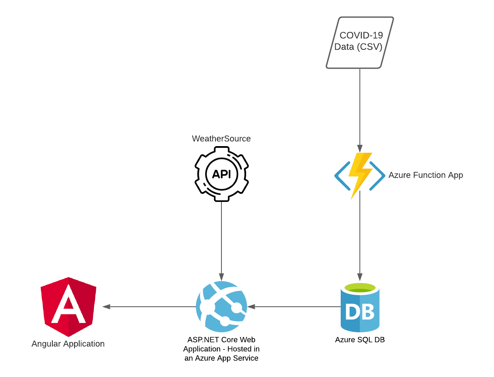

# COVID-19 and Weather Data Visualization

This repository is for my (Nick Palacio's) Masters Capstone Project. This project is a data visualization tool whose purpose would be to enable a classroom activity where students are tasked with investigating weather's role in the COVID-19 pandemic. This tool is a web application that will be implemented using Angular, .NET 5 and Azure.

The live site can be found [here](https://covid-weather-visualization.azurewebsites.net/).

The full project proposal can be found [here](./Documentation/ProjectProposal.pdf).

A zoom recording of the project proposal presentation can be found [here](https://fcsamerica.zoom.us/rec/share/yJXlMo2QgDyGtFljDos2USHCnK3Eg27Hqe7AdmCV1FzEMq1-mXOODx7CY75C9H5q.nocM_QZZSADTxiTQ). Passcode: **mTp7M&**

The GitHub project board for this can be found [here](https://github.com/npalacio/covid-and-weather-data-visualization/projects/1).

# Architecture

## Azure App Service
   - The Azure App Service will be responsible for serving up the Angular Application as well as providing several API endpoints for the weather and COVID-19 data.
   - The Weather data will come from an API from [WeatherSource](https://weathersource.com/).
   - The COVID-19 data will come from an Azure SQL Database that will be updated on a recurring basis.
## Azure Function App
   - The Azure Function App will be responsible for loading the COVID-19 data from the dataset from the New York Times hosted on [GitHub](https://github.com/nytimes/covid-19-data). This data is in a CSV format on GitHub.
## Azure SQL Database
   - The Azure SQL Database will be responsible for housing the COVID-19 data.